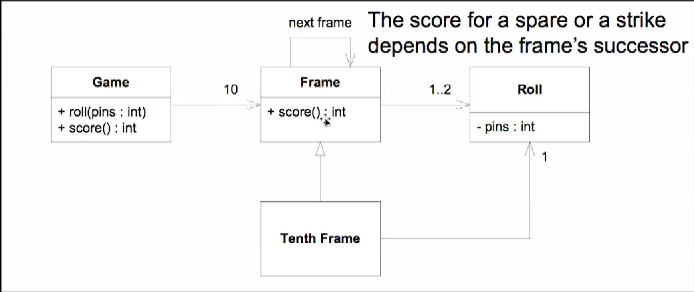

# the-go-bowling-game
This is a simulation of the Bowling Game created using the Go programming language.

I am basing this project on the Bowling Game Kata by Uncle Bob Martin. The rules of the game are as follows:



1. The game consists of 10 frames.
2. In each frame the player has two opportunities to knock down 10 pins.
3. The score for the frame is the total number of pins knocked down, plus bonuses for strikes and spares.
4. A spare is when the player knocks down all 10 pins in two tries. The bonus for that frame is the number of pins knocked down by the next roll.
5. A strike is when the player knocks down all 10 pins on his first try. The bonus for that frame is the value of the next two balls rolled.
6. In the tenth frame a player who rolls a spare or strike is allowed to roll the extra balls to complete the frame. However no more than three balls can be rolled in the tenth frame.

## Installation

To install the dependencies, run:
```sh
go get -u github.com/stretchr/testify/assert
```

## Usage
To run the tests, use:
```sh
go test
```

## Code Overview
### Game Structure
The `Game` struct represents a bowling game and contains the following fields:

- `rolls`: a slice of integers to store the number of pins knocked down in each roll.
- `currentRoll`: an integer to keep track of the current roll.

### Methods
- `NewGame() *Game`: Initializes a new game.
- `Roll(pins int)`: Records the number of pins knocked down in a roll.
- `GetScore() int`: Calculates and returns the total score of the game.
- `isSpare(firstInFrame int) bool`: Checks if a frame is a spare.
- `isStrike(firstInFrame int) bool`: Checks if a frame is a strike.

### Tests
The tests are written using the testify package and include the following scenarios:

- `TestGutterGame`: Tests a game where no pins are knocked down.
- `TestAllOnesGame`: Tests a game where one pin is knocked down in each roll.
- `TestOneSpare`: Tests a game with one spare.
- `TestOneStrike`: Tests a game with one strike.
- `TestPerfectGame`: Tests a perfect game where all rolls are strikes.
